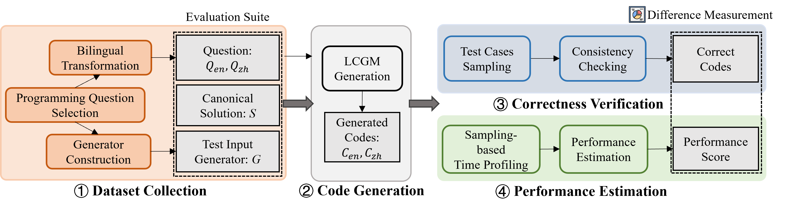

# BilingualCodeEval
This project aims studying the code quality differences, in terms of generation effectiveness and efficiency, when using different natural languages (Chinese and English) as prompts. We first curate a test suite comprising 52 bilingual programming questions through meticulous manual preparation. We then develop automated input generators for each programming question. Subsequently, we enhance correctness verification by conducting more comprehensive testing through sampling larger unit test cases. Additionally, we estimate code performance by profiling the code execution time with the growth of the input size. Based on this framework, we conduct an empirical study on six state-of-the-art LCGMs. We observe that these LCGM-generated code show different bilingual correctness on an average of 10.5% programming tasks, where 39.5% correct code also exhibits diverse bilingual performance differences. 
Our findings suggest that LCGMs may not consistently generate high-quality code across different languages, and we provide insights into the potential future research directions.


### Project Structures
- **big_o**: Implemention of tools to fit the complexity expression, which is built upon by [Pberkes_big_O](https://github.com/pberkes/big_O).
- **utils**: Implemention of some IO tools and sandbox for exection the LCGM-generated code.
- **data**: Directory for storing all data, as following:
```
- data/     
    - testsuite/
        - testsuite.csv
        - testsuite.jsonl
    - gencodes/
        -...
    - passed/  
        -...   
    - time/
        -...
    - analysis/
    - prompts.json                
```
where:

    [1] *testsuite:* The directory contains the collected test suite, stored in 'json' format for subsequent program retrieval, while the CSV format is convenient for human reading.

    [2] *gencodes, passed, time:* The structure of these three directories is identical. Each contain six subdirectories named as ['CodeGeeX','CodeGen2.5','CodeLlama','DeepSeek-Coder','StarCoder','GPT-3.5-Turbo']. Each subdirectory contains results for different prompts, languages, and temperature parameters. The "gencodes" directory is used to store the code generated by LCGMs, the "passed" directory is used to store the correctness results of the aforementioned code, where each item is augmented with a variable "passed": True/False. The "time" directory is used to store the actual execution time series for each correct code.

    [3] *analysis:* The directory is used to store the analysis results.

    [4] *prompts.json：* The file contains different prompts we used. 


- **gencodes.py**: This code invokes each LCGM and generates code for all test cases in the test suite. The generation results are saved to './data/gencodes/'.
- **run_func.py**: Implementation of correctness verification, adaptive input size adjustment, and execution time series profiling.
- **workflow.py**: Pipeline of running correctness verfication and performance profiling for code generated by multiple target LCGMs.
- **analysis_data.ipynb**: Implementation of data processing and analysis.

(All data has also been packaged for easy download. If the git clone process is slow, you can directly download and unzip them.)

### Usage Guidance
#### Install Requirements:
You can install run our project by creat a conda environment and install the requirements by pip. Details:
```python
conda create --name yourEnv python=3.8
conda activate yourEnv
pip install -r requirements.txt
```


#### How to Run:
Git clone our project and get into the BilingualCodeEval Dir. Then

1. Firstly, you can run `gencodes.py` to take the test suite as input and get the feedback of LCGMs.
```python
python gencodes.py --question testsuite.jsonl --model XXX --model_path XXX --cuda 0 --sample_num 20
```
where `model` is one of ['CodeGeeX','CodeGen2.5','CodeLlama','DeepSeek-Coder','StarCoder','GPT-3.5-Turbo'], and `model path` is the path of corresponding model downloaded from Huggingface.
The generated codes is saved under `./data/gencodes/XXX/`

2. Then, you can run `workflow.py` to  to automate the sampling-based correctness verification and execution time profiling of all collected code.
```python
python workflow.py
```
The correctness verification results will be saved under `./data/passed/` and the time profiling data will be saved under `./data/time/`.

3. Lastly, you can utilize `analysis_data.ipynb` to analyze the data, including how to fit time series data into complexity expressions and compare the differences in LCGM-generated code on bilingual inputs (as in the RQ section of the paper). You can also inspect the packaged statistical data and visualizations in dir `./data/analysis`. 


